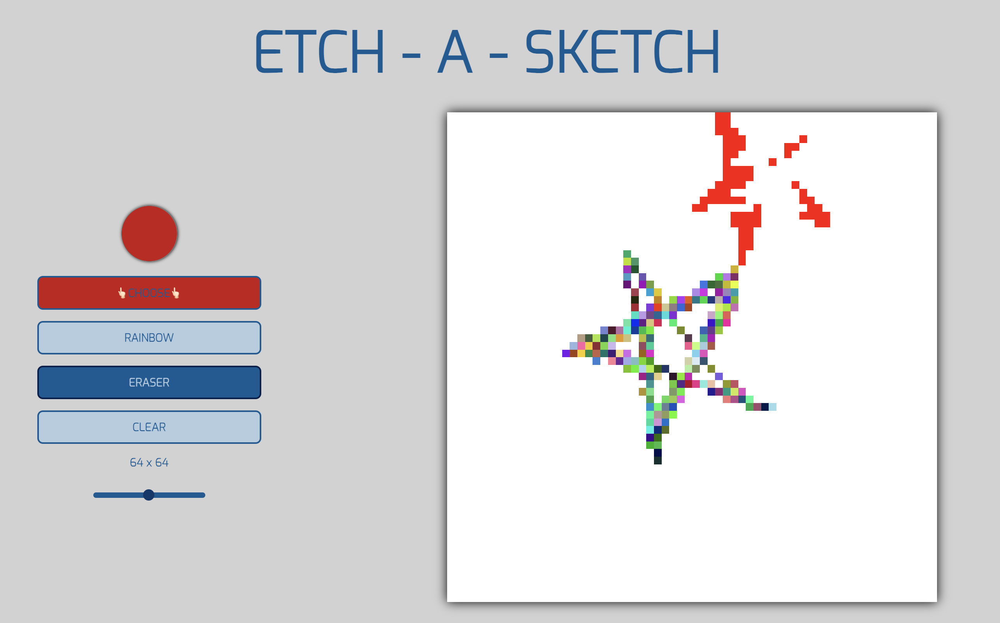
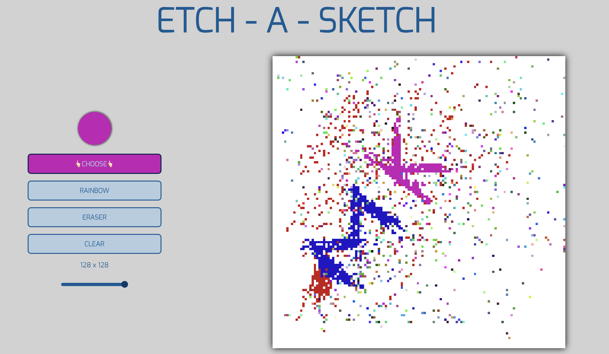

# Drawing Board 🎨




[](https://developer.mozilla.org/en-US/docs/Web/HTML)
[](https://developer.mozilla.org/en-US/docs/Web/CSS)
[](https://developer.mozilla.org/en-US/docs/Web/JavaScript)

## Description 📝

The Drawing Board is a web-based creative platform that allows users to unleash their artistic talents. This project offers an interactive canvas where you can draw, paint, and express your creativity.

## What I Learned 🧠

Throughout the development of the Drawing Board project, I gained valuable knowledge and practical experience, including:

1. **HTML, CSS, and JavaScript**: I strengthened my skills in web development, working with HTML, CSS, and JavaScript to create an interactive canvas and user-friendly interface.

2. **User Interaction**: I learned how to handle user interactions, such as mouse clicks and drags, to enable drawing and erasing functionality.

3. **Dynamic Elements**: I became proficient in dynamically updating the canvas, adjusting its size, and changing colors in real-time.

4. **UI Design**: I explored UI design concepts to make the Drawing Board visually appealing and easy to use.

5. **GitHub Collaboration**: I gained experience in collaborating on GitHub, managing issues, and accepting contributions from other developers.



## Features ✨

- **Customizable Colors**: Choose your favorite colors from a color palette.
- **Rainbow Mode**: Get creative with a rainbow of colors at your fingertips.
- **Eraser**: Correct mistakes with the eraser tool.
- **Clear Canvas**: Start fresh with the clear canvas feature.
- **Adjustable Canvas Size**: Resize the canvas to your desired dimensions.

## Demo 🚀

You can access the live demo of the Drawing Board by following this link: [Drawing Board Demo](https://musaddique333.github.io/Drawing_Board/)

## Installation 🛠️

1. Clone the repository:

   ```bash
   git clone git@github.com:musaddique333/Drawing_Board.git
  
2. Open index.html in your web browser

## Usage 🖌️

1. Open `index.html` in your web browser.
2. Select your preferred color using the color picker or choose the rainbow mode for vibrant colors.
3. Start drawing on the canvas by clicking and dragging the mouse.
4. Use the eraser tool to correct any mistakes.
5. Clear the canvas to begin a new masterpiece.
6. Adjust the canvas size to fit your creative vision.

## Contributing 🤝
Contributions are welcome! If you have any suggestions, feature requests, or bug reports, please open an issue on the [GitHub repository](https://musaddique333.github.io/Drawing_Board/issues).

## License 📜

This project is licensed under the MIT License. See the [LICENSE](LICENSE) file for details.

## Author 👨‍💻

- Author: Mohammed Musaddique
- GitHub: [Your GitHub Profile](https://github.com/musaddique333)

Enjoy creating beautiful art with the Drawing Board! If you have any questions or feedback, please don't hesitate to reach out. 🎨
